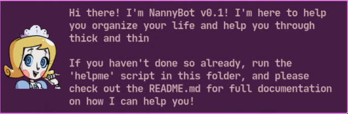

# NannyBot

Nannybot is a task managing daemon, running on zsh, that passes messages to the user via notify-send (with cute waifu faces).

The bot has only been tested using dunst, but should work with any notifcation daemon. For best results, it is suggested to have a notifcation system that allows icons to be displayed, and turned on.

Also if you make your own modules, or characters, feel free to fork

## INSTALLATION

Put the contents of this folder into ~/.config/nannybot

## DEPENDENCIES

dunst
dmenu
notify-send
zsh

## STARTING

In order to properly use NannyBot, it's highly suggested to map the script ``summon`` to a keyboard shortcut, and activate the bot that way. This script has options such as starting and stopping the bot and properly starts/stops all sub-scripts.

## USING NANNYBOT

For a quick rundown on how Nannybot works, simply run ./helpme in the nannybot directory to have a prompt show up (dmenu required) that will walk you through some of the basics

## MESSAGES

There are three kinds of notifcations; Notices, Reminders, and Prompts.

Reminders are messages that are sent as specific times, to remind you of things. They are configured under /messages/reminders

Notices are messages that are radomly picked from, and the likelyness of each individual message can be changed. Message display rate is handled by a weighted random system that functions like a lottery, the higher the number, the more "tickets" there are, and the more likely the message is to "win" (be shown)

Prompts are a subset of Notices and Reminders that display a message, but also inquire a responce from the user, and can run commands based on the answer given by the user. To answer the question the user must run the script ``summon`` in the home folder of the program. The summon script forwards you to the ``current_prompt`` script if it exists, saving you a keybind. (It is highly suggest to bind this to a hotkey, or auto-run the script) Dmenu is required, and I'm not familiar enough with non-twm style shell related programs that accept user input. Reguardless, if you know enough about using these systems, it should be very easy to port these scripts to other user-input programs.

For a more in-depth look at how flexable the messages are, please look at the files the messages are stored in, as they contain all the syntax to add your own messages.

## CREDITS

Andrew "BLink/Bombchu Link" Prater:
Program

wwwjam:
Betty's Portrait [https://www.deviantart.com/wwwjam/art/Top-of-The-Class-843588822]

Dominic Cellini:
Betty's Design [https://www.webtoons.com/en/challenge/emmy-the-robot/list?title_no=402201]
